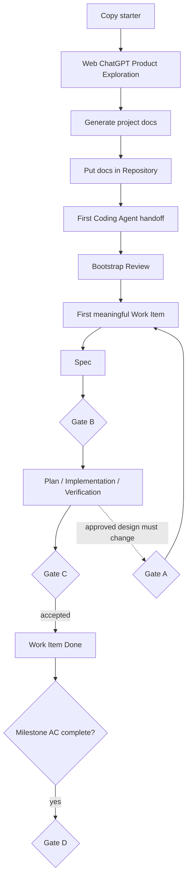

# 00 — 先看完整旅程

第一次建立 Feedback Inbox：


```mermaid
flowchart TD
    S[Copy starter] --> W[Web ChatGPT Product Exploration]
    W --> F[Generate project docs]
    F --> R[Put docs in Repository]
    R --> H[First Coding Agent handoff]
    H --> B0[Bootstrap Review]
    B0 --> WI[First meaningful Work Item]
    WI --> S2[Spec]
    S2 --> B{Gate B}
    B --> E[Plan / Implementation / Verification]
    E --> C{Gate C}
    C -->|accepted| D[Work Item Done]
    D --> M{Milestone AC complete?}
    M -->|yes| G{Gate D}

    E -. approved design must change .-> A{Gate A}
    A --> WI
```

项目建立后的三个常见输入：

```text
New Feature
Mid-flight Idea
Bug / Small UI Change
```

其中 New Feature 还会经历 Gate R。
